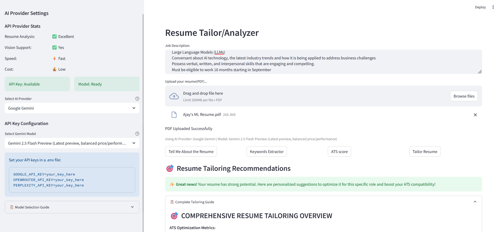

# 🎯 Resume Tailor

A Streamlit web application that leverages multiple AI providers to analyze resumes against job descriptions, providing comprehensive ATS (Applicant Tracking System) compatibility scoring and optimization recommendations.


## ✨ Key Features

### 🔍 **Multi-Provider AI Analysis**
- **Google Gemini Models**: Gemini 2.0/2.5 Flash, Pro, and specialized models
- **OpenRouter Integration**: Access to Claude 3, GPT-4o, Llama 3, and 40+ other models
- **Perplexity API**: Real-time search-enabled analysis with Sonar models
- **Dynamic Model Selection**: Choose the best model for your specific needs

### 📊 **Comprehensive Resume Analysis**
- **Resume Tailoring**: Before/after transformations with ATS optimization strategies
- **Match Percentage**: Detailed scoring methodology with weighted categories
- **Executive Summary**: Professional evaluation with strengths and gap analysis
- **Keyword Analysis**: Technical, analytical, and soft skills extraction with JSON output

### 🎨 **Modern User Experience**
- **Interactive Sidebar**: Real-time provider status and model selection
- **Progress Indicators**: Live analysis feedback with provider-specific messaging
- **Responsive Design**: Wide layout optimized for professional use
- **Extensible UI**: Component-based architecture for future enhancements

### 🛡️ **Enterprise-Grade Architecture**
- **Factory Pattern**: Modular AI provider management
- **Caching System**: Optimized response handling and performance
- **Provider Selection**: Automatic availability checking and fallback mechanisms
- **Secure Processing**: Local PDF processing with encrypted API communications


## 🏗️ Project Structure

```
Application-Tracking-System/
├── app.py                      # Main Streamlit application
├── requirements.txt            # Python dependencies
├── packages.txt               # System dependencies
├── models/                    # AI Provider implementations
│   ├── __init__.py
│   ├── base.py               # Abstract base class
│   ├── factory.py            # Factory pattern implementation
│   ├── gemini.py             # Google Gemini integration
│   ├── gemini_models.py      # Available Gemini models
│   ├── openrouter.py         # OpenRouter API integration
│   ├── openrouter_models.py  # 40+ available models
│   ├── perplexity.py         # Perplexity API integration
│   └── perplexity_models.py  # Sonar and reasoning models
├── prompts/                   # Structured AI prompts
│   ├── __init__.py
│   └── prompts.py            # Professional analysis prompts
├── providers/                 # Provider management
│   ├── __init__.py
│   └── selection.py          # Availability and capability checking
├── utils/                     # Core utilities
│   ├── __init__.py
│   ├── cache.py              # Response caching system
│   └── pdf_utils.py          # PDF processing utilities
└── tests/                     # Test suite (optional)
    └── __pycache__/
```

## 🚀 Installation & Setup

### 1. Clone the Repository
```cmd
git clone https://github.com/ajay-ramasubramanian/Resume-Tailor.git
cd Resume-Tailor
```

### 2. Create Virtual Environment
```cmd
python -m venv project
project\Scripts\activate
```

### 3. Install Dependencies
```cmd
pip install -r requirements.txt
```

### 4. System Dependencies (Windows)
Install Poppler for PDF processing:
- Download from: https://github.com/oschwartz10612/poppler-windows/releases
- Add to PATH or use the included `packages.txt` for deployment

### 5. Configure API Keys
Create a `.env` file in the root directory:
```env
# Choose one or more providers
GOOGLE_API_KEY=your_gemini_api_key_here
OPENROUTER_API_KEY=your_openrouter_api_key_here
PERPLEXITY_API_KEY=your_perplexity_api_key_here
```

### 6. Run the Application
```cmd
streamlit run app.py
```

## 🔑 API Provider Setup

### Google Gemini (Recommended for beginners)
1. Visit [Google AI Studio](https://makersuite.google.com/app/apikey)
2. Create a new API key
3. Add to `.env` as `GOOGLE_API_KEY`
4. **Best Models**: Gemini 2.0 Flash (fast), Gemini 2.5 Pro (advanced)

### OpenRouter (Most versatile)
1. Sign up at [OpenRouter](https://openrouter.ai/)
2. Generate API key in dashboard
3. Add to `.env` as `OPENROUTER_API_KEY`
4. **Best Models**: Claude 3 Opus, GPT-4o, Llama 3.1 405B
5. **Free Tier**: Several models available including Llama 3 8B

### Perplexity (Real-time analysis)
1. Get API key from [Perplexity](https://www.perplexity.ai/settings/api)
2. Add to `.env` as `PERPLEXITY_API_KEY`
3. **Best Models**: Sonar Pro, Sonar Reasoning Pro
4. **Note**: Limited image processing capabilities

## 📖 Usage Guide

### Basic Workflow
1. **Start the application**: `streamlit run app.py`
2. **Select AI Provider**: Choose from sidebar (Gemini/OpenRouter/Perplexity)
3. **Choose Model**: Select appropriate model for your analysis needs
4. **Upload Resume**: PDF format, up to 10MB recommended
5. **Add Job Description**: Paste complete job posting for accurate analysis
6. **Run Analysis**: Choose from four analysis types

### Analysis Types

#### 1. 📋 **Tell Me About the Resume**
- Executive-level candidate assessment
- Strengths and weaknesses analysis
- Professional hiring recommendation
- Interview question suggestions

#### 2. 🎯 **Get Keywords**
- Structured JSON output of skills extraction
- Technical, analytical, and soft skills categorization
- Missing keywords identification
- Optimization suggestions

#### 3. 📊 **Percentage Match**
- Quantitative scoring (0-100%)
- Weighted category analysis
- Detailed gap assessment
- Evidence-based recommendations

#### 4. ✨ **Tailor Resume**
- Before/after bullet point transformations
- Strategic keyword integration
- ATS optimization guidance
- Implementation roadmap

## 🎛️ Advanced Configuration

### Model Selection Guidelines

**For Resume Parsing & Analysis:**
- **Best Overall**: OpenRouter with Claude 3 Opus
- **Fastest**: Google Gemini 2.5 Flash
- **Most Cost-Effective**: OpenRouter free models (Qwen QwQ 32b )
- **Latest Technology**: Gemini 2.5 Pro Preview

**For Different Use Cases:**
- **Technical Resumes**: Models with strong coding analysis (GPT-4o, Claude 3)
- **Executive Positions**: Advanced reasoning models (Claude 3 Opus, Gemini 2.5 Pro)
- **Quick Screening**: Fast models (Gemini 2.0 Flash, Sonar)

### Performance Optimization
- **Caching**: Automatic response caching to reduce API calls
- **Provider Fallback**: Automatic switching if primary provider fails
- **Batch Processing**: Upload multiple resumes (planned feature)

## 🛠️ Technologies Used

### Core Framework
- **Streamlit**: Web application framework
- **Python 3.8+**: Programming language

### AI Integration
- **Google Generative AI**: Gemini models integration
- **OpenRouter API**: Multi-model access
- **Perplexity API**: Search-enabled analysis

### PDF Processing
- **PyPDF2**: Text extraction
- **pdf2image**: Image conversion
- **Pillow**: Image processing
- **Poppler**: PDF rendering engine

### Data & Utilities
- **python-dotenv**: Environment configuration
- **requests**: HTTP client for API calls
- **json**: Structured data handling

## 🌟 Why This ATS Scanner?

### Professional-Grade Analysis
- **Multi-AI Approach**: Leverage different AI strengths for comprehensive analysis
- **Industry Standards**: Based on real ATS algorithms and HR best practices
- **Quantitative Scoring**: Transparent, weighted scoring methodology

### Developer-Friendly Architecture
- **Modular Design**: Easy to extend with new AI providers
- **Factory Pattern**: Clean separation of concerns
- **Comprehensive Testing**: Robust error handling and validation

### Enterprise Ready
- **Scalable**: Handle multiple users and concurrent analyses
- **Secure**: Local processing with encrypted API communications
- **Configurable**: Flexible provider and model selection

## 🚀 Future Enhancements

- **Batch Processing**: Multiple resume analysis
- **Export Features**: PDF reports and Excel analytics
- **Comparison Mode**: A/B testing for resume versions
- **Industry Templates**: Specialized analysis for different sectors
- **Real-time Collaboration**: Team-based resume optimization

## 🤝 Contributing

1. Fork the repository
2. Create feature branch (`git checkout -b feature/amazing-feature`)
3. Commit changes (`git commit -m 'Add amazing feature'`)
4. Push to branch (`git push origin feature/amazing-feature`)
5. Open Pull Request

## 📄 License

This project is licensed under the MIT License - see the LICENSE file for details.

## 🆘 Support

- **Issues**: [GitHub Issues](https://github.com/ajay-ramasubramanian/Resume-Tailor/issues)
- **API Providers**: Refer to individual provider documentation for API limits and pricing

---

**Made with ❤️ for job seekers**
